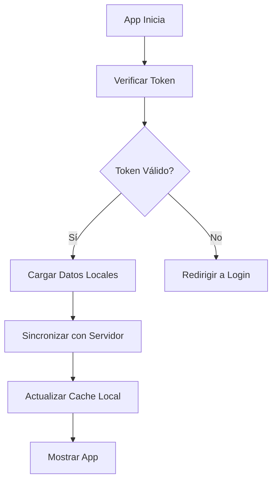
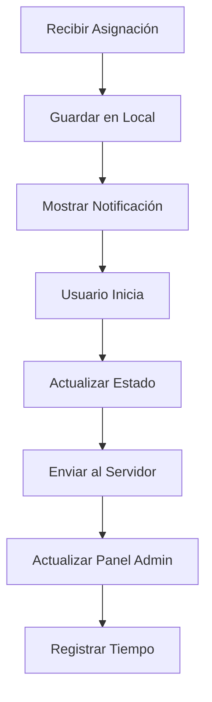
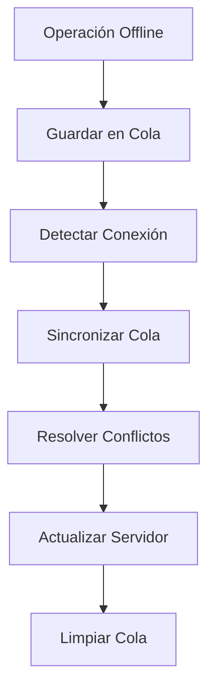

# 🚀 ARQUITECTURA COMPLETA - APP MÓVIL SAD LAS

## 📋 **RESUMEN EJECUTIVO**

### **Objetivo**

Desarrollar una aplicación móvil nativa (React Native/Expo) que se alimente de los datos del panel
administrativo web, proporcionando a las trabajadoras acceso completo a sus asignaciones, rutas,
balances y notas desde sus dispositivos móviles.

### **Arquitectura**

- **Backend**: Panel administrativo web (Next.js + Supabase)
- **Frontend Móvil**: App nativa (React Native/Expo)
- **Comunicación**: API REST + WebSockets para tiempo real
- **Base de Datos**: Supabase (compartida)

---

## 🏗️ **ARQUITECTURA TÉCNICA**

### **1. API REST Centralizada**

#### **Endpoints Existentes (Mejorar)**

```typescript
// Autenticación
POST /api/workers/auth                    // Login trabajador
POST /api/workers/logout                  // Logout
POST /api/workers/refresh-token           // Renovar token

// Asignaciones
GET /api/assignments                      // Listar asignaciones
GET /api/assignments/:id                  // Obtener asignación
PATCH /api/assignments/:id/status         // Actualizar estado
PATCH /api/assignments/:id/start-time     // Iniciar asignación
PATCH /api/assignments/:id/end-time       // Finalizar asignación

// Trabajadores
GET /api/workers/:id                      // Perfil trabajador
GET /api/workers/:id/balances             // Balances
GET /api/workers/:id/notes                // Notas del trabajador
POST /api/workers/:id/notes               // Crear nota
PATCH /api/workers/:id/profile            // Actualizar perfil

// Rutas
GET /api/workers/:id/route                // Ruta del día
GET /api/workers/:id/route/:date          // Ruta específica
POST /api/workers/:id/route/optimize      // Optimizar ruta

// Usuarios
GET /api/users/:id                        // Datos del usuario
GET /api/users/:id/address                // Dirección del usuario

// Festivos
GET /api/holidays                         // Listar festivos
GET /api/holidays/validate                // Validar festivos
```

#### **Nuevos Endpoints para Móvil**

```typescript
// Geolocalización
POST /api/workers/:id/location            // Actualizar ubicación
GET /api/workers/:id/location             // Obtener ubicación

// Notificaciones
GET /api/workers/:id/notifications        // Notificaciones
POST /api/workers/:id/notifications/read  // Marcar como leída

// Sincronización
GET /api/workers/:id/sync                 // Sincronizar datos
POST /api/workers/:id/sync/offline        // Sincronizar offline

// Reportes
POST /api/workers/:id/reports             // Enviar reporte
GET /api/workers/:id/reports              // Historial reportes
```

### **2. Autenticación y Seguridad**

#### **JWT + Refresh Tokens**

```typescript
interface AuthTokens {
  accessToken: string; // 15 minutos
  refreshToken: string; // 7 días
  expiresAt: number;
}

interface WorkerAuth {
  id: string;
  email: string;
  name: string;
  role: 'worker';
  permissions: string[];
}
```

#### **Almacenamiento Seguro**

```typescript
// Usar Expo SecureStore para tokens
import * as SecureStore from 'expo-secure-store';

class SecureStorage {
  static async setToken(token: string): Promise<void> {
    await SecureStore.setItemAsync('auth_token', token);
  }

  static async getToken(): Promise<string | null> {
    return await SecureStore.getItemAsync('auth_token');
  }
}
```

### **3. Sincronización de Datos**

#### **Estrategia Offline-First**

```typescript
// 1. Cache local con SQLite
// 2. Sincronización automática cuando hay conexión
// 3. Cola de operaciones offline
// 4. Resolución de conflictos

interface SyncStrategy {
  mode: 'online' | 'offline' | 'syncing';
  lastSync: Date;
  pendingOperations: Operation[];
}
```

#### **Base de Datos Local**

```typescript
// SQLite para datos offline
interface LocalDatabase {
  assignments: Assignment[];
  users: User[];
  notes: Note[];
  syncQueue: SyncOperation[];
}
```

---

## 📱 **ESTRUCTURA DE LA APP MÓVIL**

### **1. Navegación Principal**

```
App Navigator
├── Auth Stack
│   ├── Login Screen
│   └── Forgot Password
├── Main Tab Navigator
│   ├── Home Tab
│   │   ├── Today's Assignments
│   │   ├── Quick Actions
│   │   └── Notifications
│   ├── Route Tab
│   │   ├── Map View
│   │   ├── List View
│   │   └── Navigation
│   ├── Assignments Tab
│   │   ├── Today
│   │   ├── This Week
│   │   └── History
│   ├── Balances Tab
│   │   ├── Hours Summary
│   │   ├── Monthly Report
│   │   └── Statistics
│   └── Profile Tab
│       ├── Personal Info
│       ├── Notes
│       ├── Settings
│       └── Logout
```

### **2. Pantallas Principales**

#### **Home Screen**

```typescript
interface HomeScreen {
  // Resumen del día
  todayAssignments: Assignment[];
  totalHours: number;
  completedTasks: number;

  // Acciones rápidas
  quickActions: {
    startNextAssignment: () => void;
    markAssignmentComplete: (id: string) => void;
    addNote: () => void;
    callUser: (phone: string) => void;
  };

  // Notificaciones
  notifications: Notification[];
}
```

#### **Route Screen**

```typescript
interface RouteScreen {
  // Mapa interactivo
  mapView: {
    currentLocation: LatLng;
    routePoints: LatLng[];
    userMarkers: UserMarker[];
    trafficInfo: TrafficData;
  };

  // Lista de usuarios
  userList: {
    users: User[];
    estimatedTimes: TimeEstimate[];
    status: AssignmentStatus[];
  };

  // Navegación
  navigation: {
    startNavigation: (destination: LatLng) => void;
    optimizeRoute: () => void;
    shareLocation: () => void;
  };
}
```

#### **Assignments Screen**

```typescript
interface AssignmentsScreen {
  // Filtros
  filters: {
    date: Date;
    status: AssignmentStatus[];
    userType: string[];
  };

  // Lista de asignaciones
  assignments: {
    today: Assignment[];
    thisWeek: Assignment[];
    history: Assignment[];
  };

  // Acciones
  actions: {
    startAssignment: (id: string) => void;
    completeAssignment: (id: string) => void;
    addNote: (id: string) => void;
    reschedule: (id: string) => void;
  };
}
```

---

## 🔄 **FLUJO DE DATOS**

### **1. Sincronización Inicial**



### **2. Flujo de Asignación**



### **3. Sincronización Offline**



---

## 🛠️ **TECNOLOGÍAS RECOMENDADAS**

### **Frontend Móvil**

```json
{
  "framework": "React Native + Expo",
  "navigation": "React Navigation v6",
  "state": "Redux Toolkit + RTK Query",
  "database": "Expo SQLite",
  "storage": "Expo SecureStore",
  "maps": "React Native Maps + Google Maps",
  "notifications": "Expo Notifications",
  "camera": "Expo Camera",
  "location": "Expo Location"
}
```

### **Backend (Panel Web)**

```json
{
  "framework": "Next.js 14",
  "database": "Supabase",
  "api": "Next.js API Routes",
  "websockets": "Supabase Realtime",
  "authentication": "Supabase Auth + JWT",
  "fileStorage": "Supabase Storage"
}
```

---

## 📊 **FUNCIONALIDADES ESPECÍFICAS**

### **1. Geolocalización en Tiempo Real**

```typescript
// Tracking de ubicación
interface LocationTracking {
  // Actualizar cada 5 minutos cuando está trabajando
  updateInterval: number;

  // Enviar al servidor
  sendToServer: (location: LatLng) => Promise<void>;

  // Mostrar en mapa
  displayOnMap: (location: LatLng) => void;

  // Geofencing para asignaciones
  geofencing: {
    enterZone: (assignmentId: string) => void;
    exitZone: (assignmentId: string) => void;
  };
}
```

### **2. Notificaciones Push**

```typescript
// Notificaciones automáticas
interface PushNotifications {
  // Nuevas asignaciones
  newAssignment: (assignment: Assignment) => void;

  // Recordatorios
  reminder: (assignment: Assignment, time: number) => void;

  // Cambios de ruta
  routeChange: (newRoute: Route) => void;

  // Mensajes del admin
  adminMessage: (message: string) => void;
}
```

### **3. Modo Offline**

```typescript
// Funcionalidad offline completa
interface OfflineMode {
  // Cache de datos
  cacheData: () => Promise<void>;

  // Cola de operaciones
  queueOperation: (operation: SyncOperation) => void;

  // Sincronización automática
  autoSync: () => Promise<void>;

  // Indicador de estado
  connectionStatus: 'online' | 'offline' | 'syncing';
}
```

### **4. Reportes y Analytics**

```typescript
// Reportes automáticos
interface Reports {
  // Reporte diario
  dailyReport: () => Promise<DailyReport>;

  // Estadísticas
  statistics: () => Promise<WorkerStats>;

  // Exportar datos
  exportData: (format: 'pdf' | 'csv') => Promise<string>;
}
```

---

## 🔒 **SEGURIDAD Y PRIVACIDAD**

### **1. Autenticación Robusta**

- JWT con refresh tokens
- Biometría (huella dactilar/face ID)
- Auto-logout por inactividad
- Sesiones únicas por dispositivo

### **2. Protección de Datos**

- Encriptación local con SQLite
- Transmisión HTTPS obligatoria
- Sanitización de datos
- Logs de auditoría

### **3. Permisos Mínimos**

- Solo permisos necesarios
- Geolocalización opcional
- Notificaciones configurables
- Acceso a cámara solo cuando se necesita

---

## 📈 **ROADMAP DE DESARROLLO**

### **Fase 1: MVP (4-6 semanas)**

- [ ] Autenticación básica
- [ ] Lista de asignaciones
- [ ] Vista de ruta básica
- [ ] Sincronización online
- [ ] Notificaciones básicas

### **Fase 2: Funcionalidades Avanzadas (6-8 semanas)**

- [ ] Modo offline completo
- [ ] Geolocalización en tiempo real
- [ ] Navegación integrada
- [ ] Reportes automáticos
- [ ] Notificaciones push

### **Fase 3: Optimización (4-6 semanas)**

- [ ] Performance optimization
- [ ] UI/UX refinements
- [ ] Testing completo
- [ ] Deployment a stores
- [ ] Documentación

### **Fase 4: Escalabilidad (Ongoing)**

- [ ] Analytics avanzados
- [ ] Integración con wearables
- [ ] IA para optimización de rutas
- [ ] Integración con sistemas externos

---

## 🎯 **BENEFICIOS ESPERADOS**

### **Para Trabajadoras**

- ✅ Acceso inmediato a asignaciones
- ✅ Navegación optimizada
- ✅ Registro automático de horas
- ✅ Comunicación directa con admin
- ✅ Trabajo offline

### **Para Administradores**

- ✅ Tracking en tiempo real
- ✅ Reportes automáticos
- ✅ Mejor comunicación
- ✅ Optimización de rutas
- ✅ Reducción de errores

### **Para la Empresa**

- ✅ Mayor productividad
- ✅ Mejor servicio al cliente
- ✅ Reducción de costos
- ✅ Datos más precisos
- ✅ Escalabilidad

---

## 🚀 **PRÓXIMOS PASOS**

### **1. Preparación del Backend**

- [ ] Expandir API endpoints
- [ ] Implementar WebSockets
- [ ] Configurar CORS para móvil
- [ ] Optimizar consultas

### **2. Configuración del Proyecto Móvil**

- [ ] Crear proyecto Expo
- [ ] Configurar TypeScript
- [ ] Instalar dependencias
- [ ] Configurar navegación

### **3. Desarrollo Paralelo**

- [ ] Backend: API endpoints
- [ ] Móvil: UI básica
- [ ] Integración: Autenticación
- [ ] Testing: Funcionalidad básica

**¿Te parece bien esta arquitectura? ¿Quieres que empecemos con alguna fase específica?** 🚀
